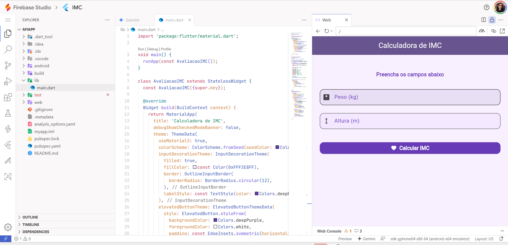
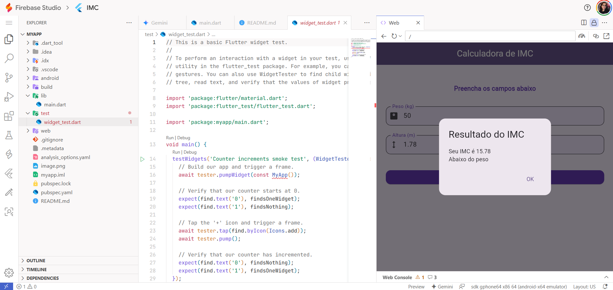

# 📱 Calculadora de IMC - Flutter

Este é um aplicativo simples e bonito desenvolvido em Flutter para calcular o **IMC (Índice de Massa Corporal)** com base no peso e altura informados pelo usuário. Ideal para fins educacionais, aprendizado de Flutter e projetos pessoais.

## ✨ Funcionalidades

- Entrada de **peso** (kg)
- Entrada de **altura** (m)
- Cálculo automático do IMC
- Classificação conforme a tabela da OMS:
  - Abaixo do peso
  - Peso normal
  - Sobrepeso
  - Obesidade Grau I
  - Obesidade Grau II
  - Obesidade Grau III
- Interface amigável com **Material 3**, cores suaves e ícones

## Prints

